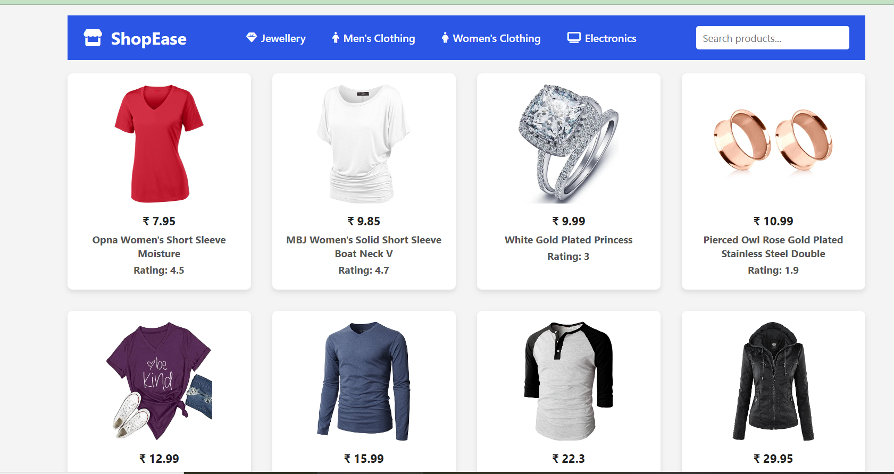
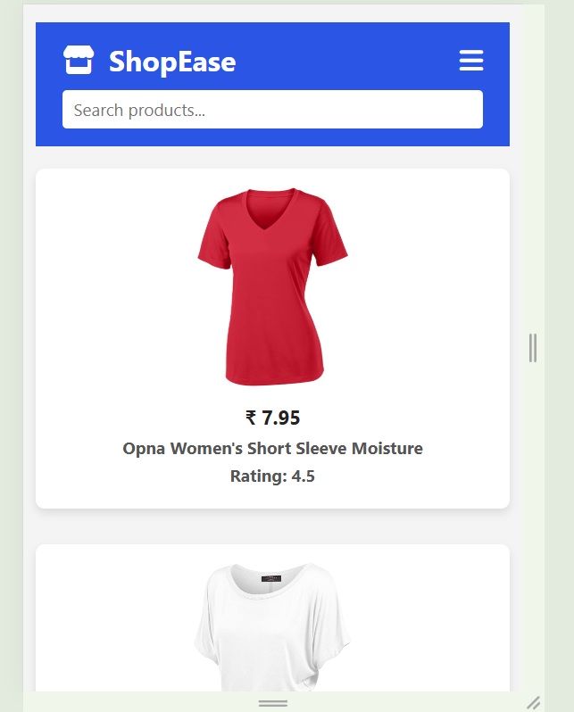
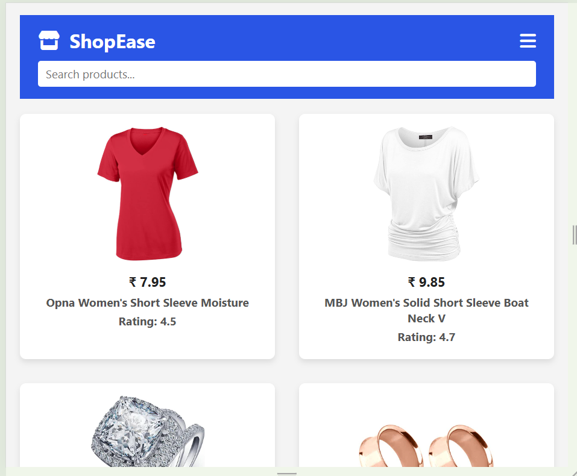

# 🛍️ ShopEase Store

ShopEase is a modern and responsive e-commerce frontend project built using **HTML**, **CSS**, and **JavaScript**. It fetches real-time product data from the [Fake Store API](https://fakestoreapi.com/) and provides dynamic filtering, category browsing, and a responsive UI for all devices.

---

## 🚀 Live Demo

[🔗 View Live on GitHub Pages](https://developer-fardin786.github.io/shopease-store/)

---

## 📸 Screenshots

---

## 🧱 Features

- 🔎 Real-time product search
- 🧩 Filter by category (e.g., Jewellery, Men's Clothing)
- 📱 Responsive layout (mobile, tablet, desktop)
- 🍔 Hamburger menu on mobile
- 📦 Dynamic data from Fake Store API
- ✨ Clean and modern UI
- 🦶 Footer with social links and contact info

---

## 🗂️ Project Structure

shopease-store/
│
├── index.html            # Main HTML file
├── style.css             # CSS styles
├── index.js              # JavaScript functionality
├── README.md             # Project README file
│
├── screenshots/          # Folder for screenshots images
│   ├── desktop-view.png
│   ├── mobile-view.png
│   └── tablet-view.png
